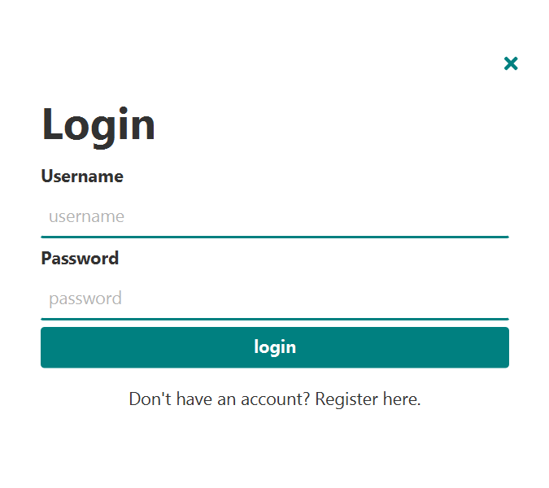
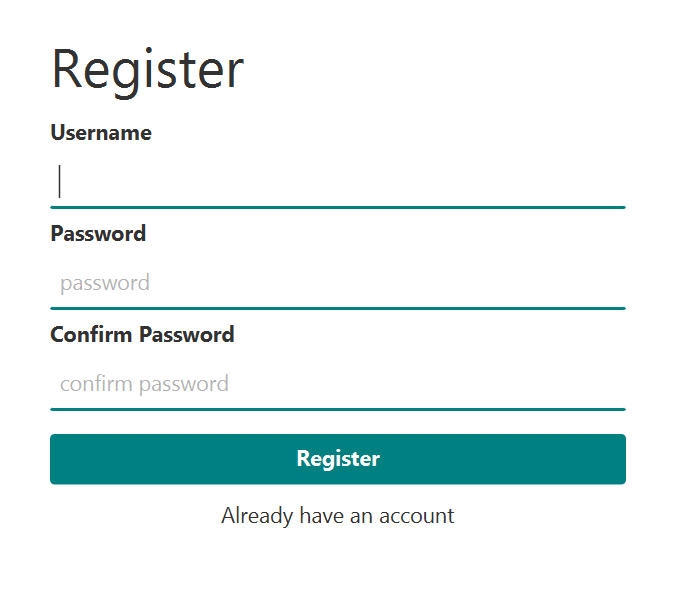

# JavaFX Xpass password manager

## Overview

	XPass is a simple multiple user password manager to store your passwords securely. The app has a couple of features that allow you to keep all your passwords in one place. The passwords are encryped by your own personal secret key.

Here are some of the features

<ul>
	<li>CRUD passwords</li>
	<li>Encryption</li>
	<li>Decryption</li>
	<li>Filter</li>
	<li>Multiple Users</li>
	<li>Protected Copy and Paste</li>	
	<li>Password generator</li>	
	<li>User Profile</li>	
</ul>

***

### Login

	The login will show up as soon as the app is launched. If the user does not have an account, they will be able to create one by clicking on the link "Don't have an account"

***

### Register

	If the user does not have an account they can create one.

***

### Home

	Once the user is logged in the home screen will show up. They will be able to store whatever password they want by clicking on new button on the left menu. They can edit and delete passwords that had been already registered. To see the password they have to right click on the password which will display a context menu show and copy and provide their user password to allow the action to proceed.
	

*** 

### New

	The new screen is where the use will be able to add their personal passwords, they can also make use of the password generator instead of creating a new password.	

### Settings

	The settings screen is where users will be able to change the username, photo and email. The password can also be changed but they have to type the old password first.

